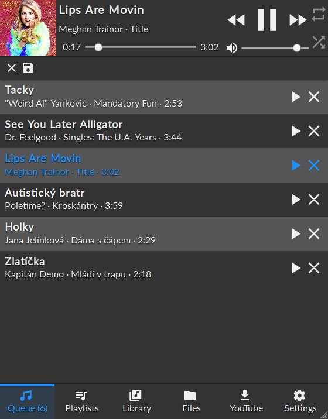

# CYP: Control Your Player

CYP is a web-based frontend for [MPD](https://www.musicpd.org/), the Music Player Daemon. You can use it to control the playback without having to install native application(s). It works in modern web browsers, both desktop and mobile.

## Screenshots

 


## Features
  - Control the playback, queue, volume
  - Save and load playlists
  - Browse the library by artists/albums/directories
  - Display album art via native MPD calls (no need to access the library; requires MPD >= 0.21)
  - [Youtube-dl](https://ytdl-org.github.io/youtube-dl/index.html) intergration


## Installation

Make sure you have a working MPD setup first.

```sh
git clone https://github.com/ondras/cyp.git && cd cyp
npm i
node .
```

Point your browser to http://localhost:8080 to open the interface.


## Technology
  - Connected to MPD via WebSockets (using the [ws2mpd](https://github.com/ondras/ws2mpd/) bridge)
  - Token-based access to the WebSocket endpoint (better than an `Origin` check)
  - Modern ES6+ (modules, async/await)
  - Responsive layout via Flexbox
  - CSS Custom Properties
  - SVG icons (Material Design)
  - Dark/Light theme available
  - Can spawn Youtube-dl to download audio files
  - Album art retrieved directly from MPD (and cached via localStorage)


## TODO

  - [ ] Bundling
  - [ ] Range styling
  - [ ] Browser testing
