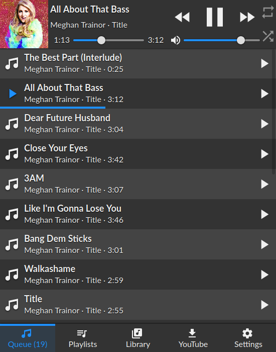
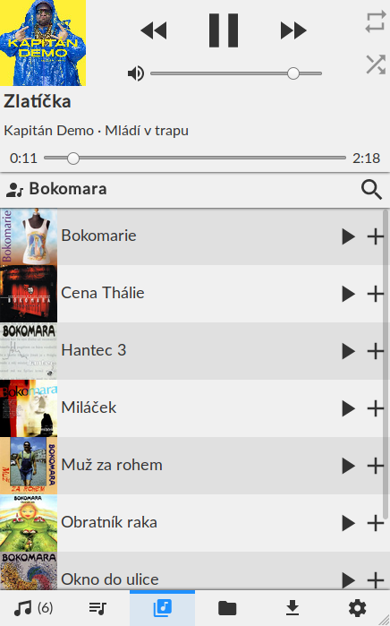

# CYP: Control Your Player

CYP is a web-based frontend for [MPD](https://www.musicpd.org/), the Music Player Daemon. You can use it to control the playback without having to install native application(s). It works in modern web browsers, both desktop and mobile.

## Screenshots

 


## Features
  - Control the playback, queue, volume
  - Save and load playlists
  - Browse the library by artists/albums/directories
  - Display album art via native MPD calls (no need to access the library; requires MPD >= 0.21)
  - [Youtube-dl](https://ytdl-org.github.io/youtube-dl/index.html) integration
  - Dark/Light themes


## Installation

Make sure you have a working MPD setup first and Node version >= 10

```sh
git clone https://github.com/ondras/cyp.git && cd cyp
npm i
node .
```

Point your browser to http://localhost:8080 to open the interface. Specify a custom MPD address via a `server` querystring argument (`?server=localhost:6655`).

## Instalation - Docker

Alternatively, you can use Docker to run CYP.

```sh
git clone https://github.com/ondras/cyp.git && cd cyp
docker build -t cyp .
docker run --network=host cyp
```

## Installation - Apache ProxyPass

If you want to run CYP as a service and proxy it through Apache2, you will need to enable several modules.

    # a2enmod proxy
    # a2enmod proxy_http
    # a2enmod proxy_wstunnel
    # a2enmod proxypass


To present CYP in a virutal folder named "music" (https://example.com/music/) add the following to your site config.

	
    # MPD daemon
	RewriteEngine on						# Enable the RewriteEngine
	RewriteCond %{REQUEST_FILENAME} !-f		# If the requested file isn't a file
	RewriteCond %{REQUEST_FILENAME} !-d		# And if it isn't a directory
	RewriteCond %{REQUEST_URI} .*/music$	# And if they only requested /music instead of /music/
	RewriteRule ^(.+[^/])$ %{REQUEST_URI}/ [QSA,L,R=301] # Then append a trailing slash

	ProxyPass /music/ http://localhost:3366/	# Proxy all request to /music/ to the CYP server (running on the same server as apache)
	ProxyWebsocketFallbackToProxyHttp Off		# Don't fallback to http for WebSocket requests

	# Rewrite WebSocket requests to CYP WebSocket requets, (also converts wss to ws)
	RewriteEngine on						
	RewriteCond %{HTTP:Upgrade} websocket [NC]  
	RewriteCond %{HTTP:Connection} upgrade [NC]
	RewriteRule ^/music/?(.*) "ws://localhost:3366/$1" [P,L]

## Installation - nginx

    location /music/ {
      proxy_pass_header  Set-Cookie;
      proxy_set_header   Host               $host;
      proxy_set_header   X-Real-IP          $remote_addr;
      proxy_set_header   X-Forwarded-Proto  $scheme;
      proxy_set_header   X-Forwarded-For    $proxy_add_x_forwarded_for;
      proxy_http_version 1.1;
      proxy_set_header Upgrade $http_upgrade;
      proxy_set_header Connection "Upgrade";
      proxy_set_header Host $host;
      proxy_pass http://localhost:8080/;
    }
  


## Youtube-dl integration

You will need a working [youtube-dl](https://ytdl-org.github.io/youtube-dl/index.html) installation. Audio files are downloaded into the `_youtube` directory, so make sure it is available to your MPD library (use a symlink).

If you use Docker, you need to mount the `_youtube` directory into the image:

```sh
docker run --network=host -v "$(pwd)"/_youtube:/cyp/_youtube cyp
```


## Changing the port

...is done via the `PORT` environment variable. If you use Docker, the `-e` switch does the trick:

```sh
docker run --network=host -e PORT=12345 cyp
```

## Password-protected MPD

Create a `passwords.json` file in CYPs home directory. Specify passwords for available MPD servers:

```json
{
  "localhost:6600": "my-pass-1",
  "some.other.server.or.ip:12345": "my-pass-2"
}
```

Make sure that hostnames and ports match those specified via the `server` querystring argument (defaults to `localhost:6600`).

## Technology
  - Connected to MPD via WebSockets (using the [ws2mpd](https://github.com/ondras/ws2mpd/) bridge)
  - Token-based access to the WebSocket endpoint (better than an `Origin` check)
  - Written using [*Custom Elements*](https://developer.mozilla.org/en-US/docs/Web/Web_Components/Using_custom_elements)
  - Responsive layout via Flexbox
  - CSS Custom Properties
  - SVG icons (Material Design)
  - Can spawn Youtube-dl to search/download audio files
  - Album art retrieved directly from MPD (and cached via localStorage)
